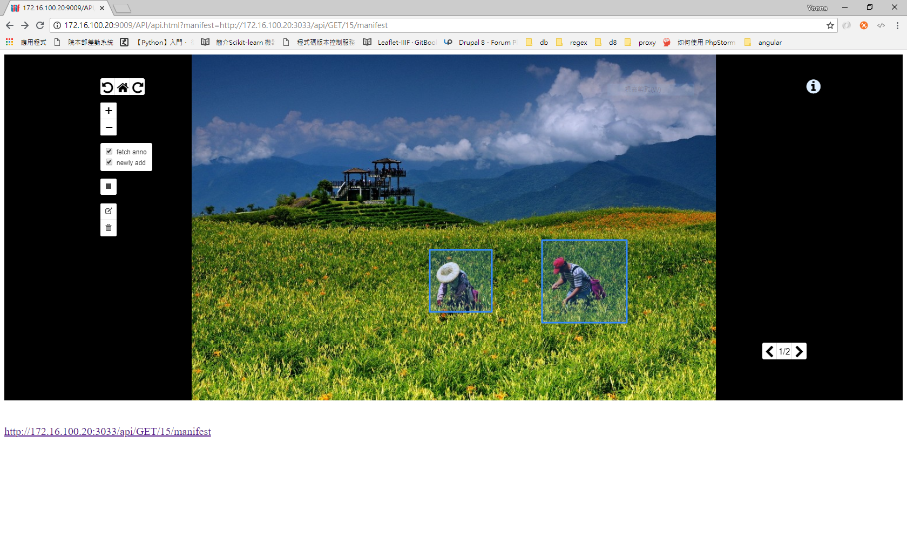

# IIIF-Leaflet-Viewer

### Doc
This include three major versions:
* `IE`: Support IE usage, but having less functionality.
* `Show`: Support viewing image and annotations with IIIF Image API style
* `API`: This is the front-end project of the Annotation-Server, providing the functionality of creating, updating and deleting annotations on the viewer

### Gallery

#### © ascdc all rights reserved
Special thanks: EustaceCheng <fbi0258zzz@gmail.com>
